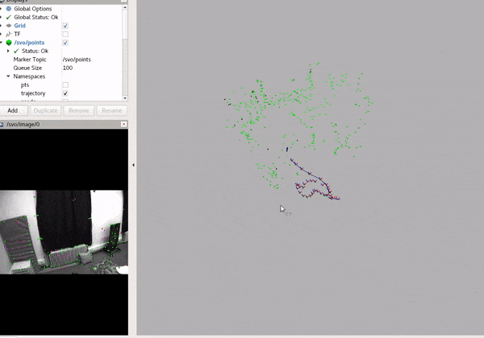

# Visual-inertial Odometry with SVO frontend

The visual-inertial odometry consists of the SVO 2.0 frontend and OKVIS style sliding window backend. Both monocular and stereo setups are supprted.

Loop closure and correction using DBoW2 is also supported, but we are relative conservative on regarding loop corrections (i.e., only very good match results after 2D-2D/2D-3D check + large pose correction will be accepted). In brief, we additionally extract ORB features for the purpose of loop closure, and the depths of these ORB features are estimated using depth filters.

## Examples on EuRoC
Source the workspace first:
```sh
source ~/svo_ws/devel/setup.bash
```

## Monocular VIO
```sh
# launch svo
roslaunch svo_ros euroc_vio_mono.launch
# run the EuRoC bag
rosbag play V2_02_medium.bag -s 10
```
You might need to adjust a starting time to get the monocular pipeline started properly, as in the pure monocular case. You should be able to see a visualization like this:




where the green points are the landmarks optimized by the backend, which are fed back to the frontend for tracking. The brighter the color, the newer the landmarks are.

You will also see line segments that connecting the current frame and the past keyframes. Thoes indicates loop closures, where a red line indicates successful recognition and a green one indicates actual pose correction.

## Stereo VIO
```sh
# launch svo
roslaunch svo_ros euroc_vio_stereo.launch
# run the EuRoC bag
rosbag play V2_03_difficult.bag
```
You should be able to see similar visualization as in the monocular case.

## Parameters
The above launch files use the parameters in `svo_ros/param/vio_mono` and `svo_ros/param/vio_stere`. They are essentially identical, except for the flat `pipeline_is_stereo` to indicate whether stereo or monocular setup should be used.
